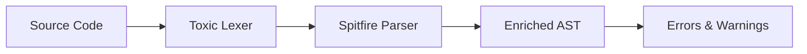

# High Level Design: Spitfire (Error-Tolerant Elixir Parser)

## 1. Introduction

Spitfire is a handwritten, error-tolerant parser for Elixir designed to power IDEs, Language Servers (LSP), and static analysis tools. Unlike the standard Elixir parser (`yecc`-based), Spitfire prioritizes resilience—it must produce a valid syntax tree even in the presence of syntax errors—and precise source mapping.

This design leverages the **Toxic** lexer for tokenization and implements a hybrid **Recursive Descent** and **Pratt Parser** (Top-Down Operator Precedence) to handle Elixir's flexible grammar.

## 2. Design Goals

1.  **Error Tolerance**: The parser must never crash. It should recover from errors by skipping invalid tokens or synthesizing missing ones, producing a "best-effort" AST.
2.  **Fidelity**: The AST should map 1:1 to the source code where possible, preserving location data (ranges) for every node.
3.  **Compatibility**: The output AST should be convertible to standard Elixir AST to allow interoperability with existing tools, though the internal representation may be richer (e.g., "Green Tree" or enriched AST).
4.  **Performance**: Suitable for real-time analysis in editors (parsing on keystroke).

## 3. Architecture

The parsing pipeline consists of three stages:



### 3.1. Tokenizer (Toxic)

We utilize the **Toxic** library, a streaming tokenizer specifically built for this project.
*   **Input**: `String` or `Charlist`.
*   **Output**: Stream of `{type, meta, value}` tokens.
*   **Features**:
    *   Handles Elixir's complex string interpolations and sigils.
    *   Provides `{{start_line, start_col}, {end_line, end_col}, extra}` metadata.
    *   Supports "tolerant mode" to emit error tokens instead of halting.
    *   Linearizes complex tokens (e.g., strings with interpolations become a sequence of tokens), simplifying the parser's job.

### 3.2. Parser Strategy: Pratt + Recursive Descent

Elixir's grammar is heavily expression-based with many operators, making **Pratt Parsing** the ideal choice for the core expression parsing logic. Structural constructs (like `defmodule`, `do...end` blocks) are handled via **Recursive Descent**.

*   **Pratt Parsing**: Handles expressions like `1 + 2 * 3`, `map.field`, and function calls without parentheses. It uses a lookup table for "Binding Power" (precedence) based on `elixir_parser.yrl`.
*   **Recursive Descent**: Handles the overall file structure, block delimiters, and specific constructs that don't fit strictly into operator precedence (though in Elixir, almost everything is an expression).

## 4. Detailed Design

### 4.1. The Parser Loop

The parser struct maintains state:
```elixir
defstruct [
  :tokens,       # Token stream (Toxic)
  :errors,       # Accumulated errors
  :fuel,         # For loop protection
  :terminators   # Stack of expected closing tokens (e.g., :end, :")")
]
```

The main loop repeatedly calls `parse_expression(binding_power)` until EOF.

### 4.2. Precedence Table (Derived from `elixir_parser.yrl`)

We map the LALR(1) precedence levels to Pratt Binding Powers (bp).

| Operator Category | YRL Precedence | Pratt BP (Approx) | Assoc |
| :--- | :--- | :--- | :--- |
| `do` | 5 | 10 | Left |
| `->` (stab) | 10 | 20 | Right |
| `,` | 20 | 30 | Left |
| `<-`, `\\` | 40 | 50 | Left |
| `when` | 50 | 60 | Right |
| `::` | 60 | 70 | Right |
| `|` | 70 | 80 | Right |
| `=>` | 80 | 90 | Right |
| `&` | 90 | 100 | Non |
| `=` | 100 | 110 | Right |
| `||`, `&&` | 120, 130 | 130, 140 | Left |
| `==`, `<`, `>` | 140, 150 | 150, 160 | Left |
| `|>` | 160 | 170 | Left |
| `in` | 170 | 180 | Left |
| `++`, `..` | 200 | 210 | Right |
| `+`, `-` | 210 | 220 | Left |
| `*`, `/` | 220 | 230 | Left |
| `**` | 230 | 240 | Left |
| Unary `!`, `^` | 300 | 300 | Prefix |
| `.` (dot), `()` | 310 | 310 | Left |
| `@` | 320 | 320 | Prefix |

### 4.3. Parsing Functions (NUD & LED)

In Pratt parsing, tokens are handled based on whether they appear at the beginning of an expression (Null Denotation - NUD) or between expressions (Left Denotation - LED).

*   **NUD (Null Denotation)**: "Values" and Prefix Operators.
    *   `Integer`, `Float`, `String`, `Charlist`: Return literal node.
    *   `Identifier`: Return variable/call node.
    *   `@`: Parse attribute (unary).
    *   `fn`: Parse anonymous function (recursive descent for clauses).
    *   `(`: Parse grouped expression or tuple.
    *   `[`: Parse list or keyword list.
    *   `{`: Parse tuple or map.
    *   `%`: Parse map or struct.

*   **LED (Left Denotation)**: Infix and Postfix Operators.
    *   `+`, `-`, `*`, `/`: Parse binary op.
    *   `.`: Parse remote call or field access.
    *   `(`: Parse function call arguments (when following an identifier).
    *   `[`: Parse access (e.g., `foo[bar]`).
    *   `do`: Parse do-block (binds to previous call).

### 4.4. Handling "No Parentheses" Calls

Elixir allows `func arg1, arg2`. This is ambiguous with `func(arg1, arg2)`.
*   **Strategy**: When an identifier is parsed (NUD), check if the *next* token is the start of an expression (and not an operator that binds tighter).
*   If yes, parse the following tokens as arguments to the identifier.
*   This requires careful handling of whitespace/newlines (provided by Toxic's `eol` tokens or metadata) to distinguish `func -1` (call with arg -1) from `func - 1` (subtraction).

### 4.5. Error Recovery

When an unexpected token is encountered:

1.  **Error Node Creation**: Create an `ErrorNode` in the AST containing the unexpected token and the expected type.
2.  **Synchronization**:
    *   **Panic Mode**: Advance tokens until a "synchronization token" is found (e.g., `;`, newline, `end`, `)`, `]`).
    *   **Insertion**: If a closing token is missing (e.g., `)`), synthesize it to close the current node and continue.
3.  **Resumption**: Return the `ErrorNode` (or a partial valid node containing the error) so the parent parser can continue.

**Example**: `def my_func(a, b` (missing `)`)
*   Parser expects `)` or `,`. Finds `do` or newline.
*   Action: Emit error "Missing closing parenthesis". Synthesize `)` to complete the `def` arguments. Continue parsing the body.

## 5. AST Structure

The AST will mirror standard Elixir AST but wrapped in a struct to hold extra data.

```elixir
# Standard Elixir: {:+, [line: 1], [1, 2]}
# Spitfire Node:
%Spitfire.Node{
  type: :binary_op,
  op: :+,
  left: %Spitfire.Node{type: :integer, value: 1, ...},
  right: %Spitfire.Node{type: :integer, value: 2, ...},
  range: {{1, 1}, {1, 6}},
  metadata: [line: 1]
}
```

We will provide a `to_quoted/1` function to convert this back to standard Elixir AST.

## 6. Specific Challenges & Solutions

### 6.1. `do` Blocks
`do` blocks are syntactically sugar for `[do: ...]`.
*   **Parser**: Treat `do` as a high-precedence infix operator (LED) that binds to the preceding function call.
*   **Recovery**: If `end` is missing, scan indentation or look for the next `def`/`defmodule` to infer closure (or just consume until EOF and mark error).

### 6.2. Keywords vs Lists
`[a: 1, b: 2]` vs `[a, b]`.
*   **Parser**: Inside `[` (NUD), check if elements are key-value pairs. Elixir allows mixed, but keywords must be last.
*   **Recovery**: If syntax is mixed invalidly, emit error but preserve all elements in the AST.

### 6.3. Newlines
Newlines in Elixir can be statement terminators.
*   **Toxic**: Emits `eol` tokens.
*   **Parser**: The main loop consumes `eol` as statement separators. Inside expressions (e.g., inside `()`), `eol` is generally ignored unless it separates arguments in a way that changes meaning.

## 7. Implementation Plan

1.  **Infrastructure**: Setup `Spitfire` module, integrate `Toxic`.
2.  **Basic Expressions**: Implement Pratt loop for literals and basic arithmetic (`+`, `-`, `*`).
3.  **Structure**: Implement `do...end` blocks and function calls.
4.  **Containers**: Lists, Tuples, Maps, Binaries.
5.  **Advanced**: Sigils, Interpolation (consuming Toxic's linear tokens).
6.  **Recovery**: Add synchronization logic and error node generation.
7.  **Testing**: Property-based testing (generating random valid/invalid code) to ensure no crashes.

## 8. References
*   `elixir_parser.yrl`: Source of truth for precedence.
*   `Toxic`: Source of tokens.
*   `Prism` (Ruby): Inspiration for error-tolerant recursive descent.
